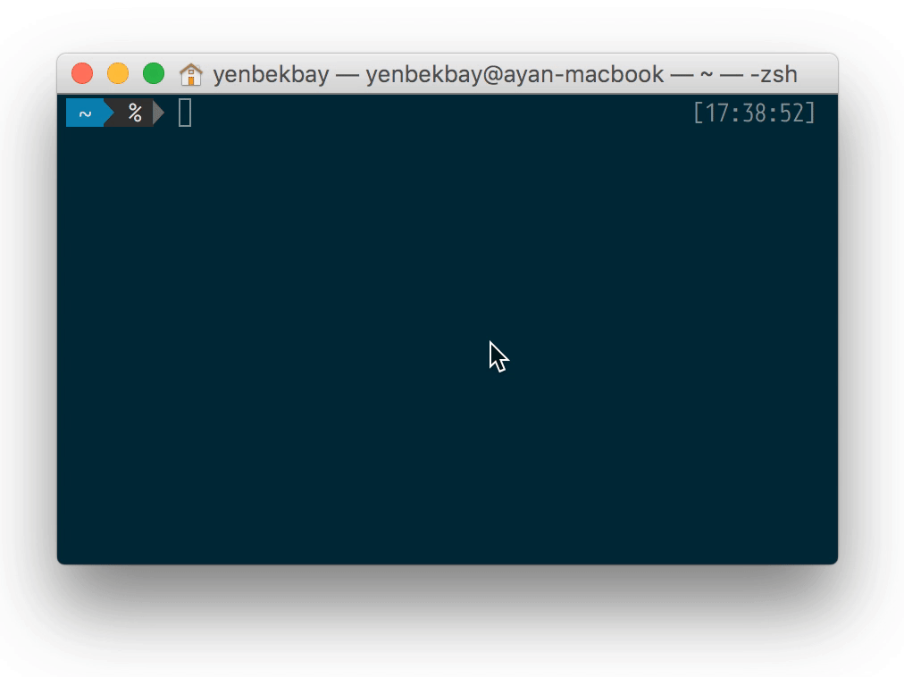

# kzt
**A cli tool to get latest KZT (tenge) exchange rates**

[![NPM version][npm-image]][npm-url] [![Downloads][downloads-image]][npm-url] [![Build Status][travis-image]][travis-url]  [![Dependency Status][daviddm-image]][daviddm-url]

[![NodeICO][nodeico-image]][nodeico-url]



## Installation

``` bash
  $ [sudo] npm install kzt -g
```

## Usage

```bash
kzt [-h] [-c {"USD", "EUR", "RUB"}] [-a]

Options:
  -c, --currencies  choose the currencies to display KZT exchange rates for
           [array] [choices: "USD", "EUR", "RUB"] [default: ["USD","EUR","RUB"]]
  -a, --all         display KZT exchange rates from all sources        [boolean]
  -h, --help        Show help                                          [boolean]

Examples:
  kzt -a -c USD   display exchange rates to USD from all sources
  kzt -c USD EUR  display average exchange rates to USD and EUR
```

## The MIT License

Copyright (C) 2015  Ayan Yenbekbay

Permission is hereby granted, free of charge, to any person obtaining a copy
of this software and associated documentation files (the "Software"), to deal
in the Software without restriction, including without limitation the rights
to use, copy, modify, merge, publish, distribute, sublicense, and/or sell
copies of the Software, and to permit persons to whom the Software is
furnished to do so, subject to the following conditions:

The above copyright notice and this permission notice shall be included in
all copies or substantial portions of the Software.

THE SOFTWARE IS PROVIDED "AS IS", WITHOUT WARRANTY OF ANY KIND, EXPRESS OR
IMPLIED, INCLUDING BUT NOT LIMITED TO THE WARRANTIES OF MERCHANTABILITY,
FITNESS FOR A PARTICULAR PURPOSE AND NONINFRINGEMENT. IN NO EVENT SHALL THE
AUTHORS OR COPYRIGHT HOLDERS BE LIABLE FOR ANY CLAIM, DAMAGES OR OTHER
LIABILITY, WHETHER IN AN ACTION OF CONTRACT, TORT OR OTHERWISE, ARISING FROM,
OUT OF OR IN CONNECTION WITH THE SOFTWARE OR THE USE OR OTHER DEALINGS IN
THE SOFTWARE.

[downloads-image]: https://img.shields.io/npm/dm/kzt.svg
[npm-url]: https://www.npmjs.com/package/kzt
[npm-image]: https://img.shields.io/npm/v/kzt.svg

[travis-url]: https://travis-ci.org/yenbekbay/kzt
[travis-image]: https://img.shields.io/travis/yenbekbay/kzt.svg

[daviddm-image]: https://david-dm.org/yenbekbay/kzt.svg?theme=shields.io
[daviddm-url]: https://david-dm.org/yenbekbay/kzt

[nodeico-url]: https://nodei.co/npm/kzt
[nodeico-image]: https://nodei.co/npm/kzt.png?downloads=true&downloadRank=true
